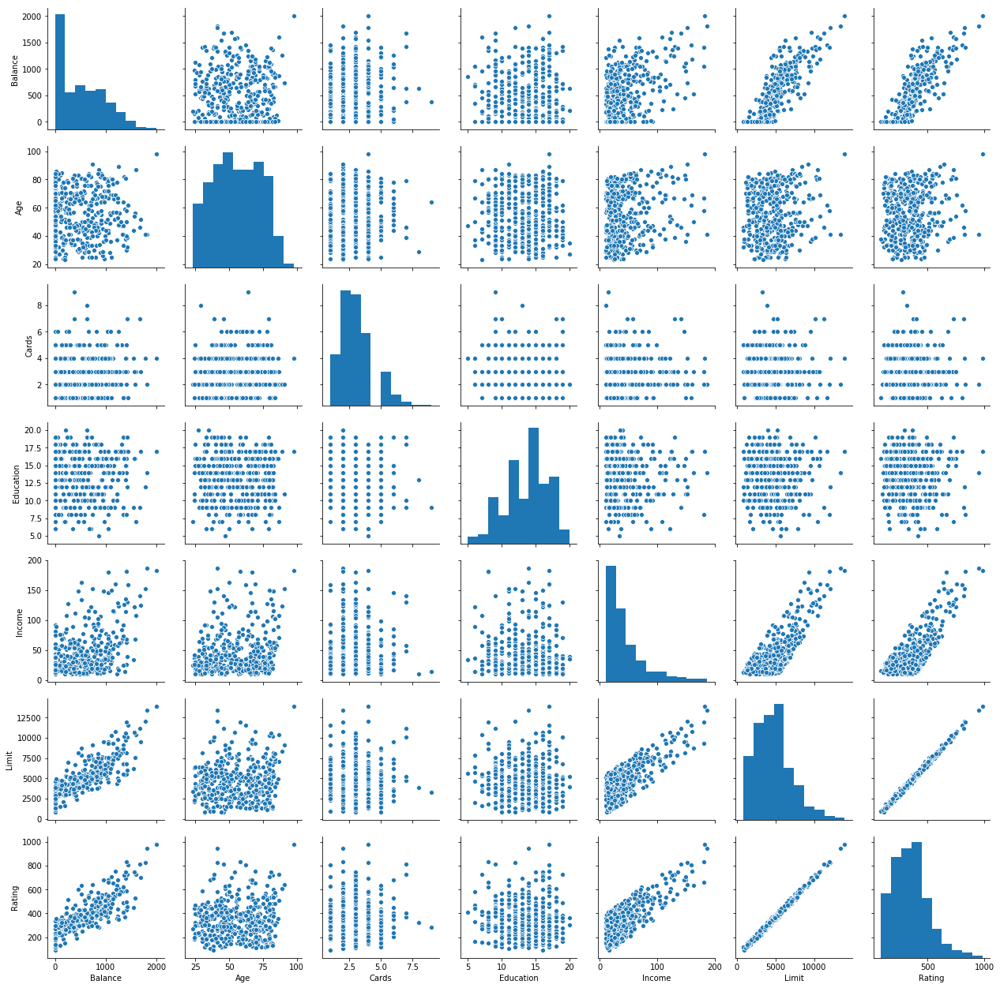
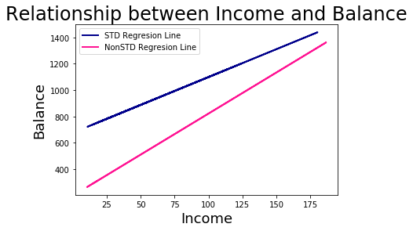
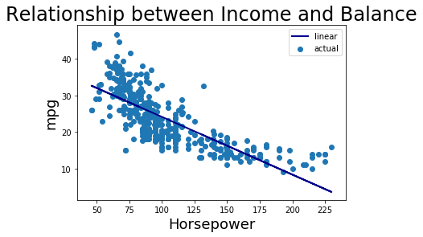
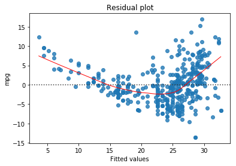
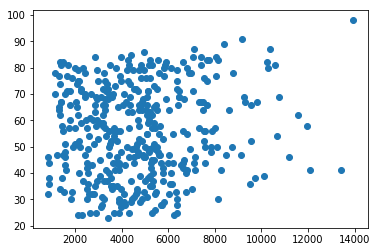
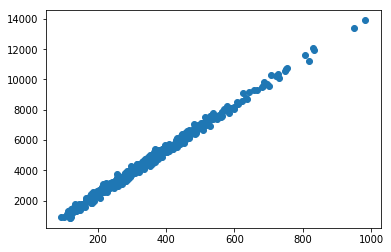

#3-3 **Other Considerations in the Regression Model**


**3.3.1 Qualitative Predictors(질적 설명변수)**

대부분의 선형회귀모델의 변수는 양적(Quantitative)라고 가정했다. 하지만, 질적(Qualitative)인 경우도 많다.


```python
#사용할 패키지 로드

import pandas as pd
import numpy as np
import matplotlib.pyplot as plt
import seaborn as sns
from statsmodels.formula.api import ols
import statsmodels.api as sm
from sklearn.linear_model import LinearRegression
import scipy.stats as stats
```


```python
url = 'https://raw.githubusercontent.com/Kulbear/ISLR-Python/master/data/Credit.csv' # github에 있는 raw파일 로드
credit = pd.read_csv(url, index_col=0) # credit dataframe에 저장
credit.head(2)
```


<div>
<style scoped>
    .dataframe tbody tr th:only-of-type {
        vertical-align: middle;
    }

    .dataframe tbody tr th {
        vertical-align: top;
    }

    .dataframe thead th {
        text-align: right;
    }
</style>
<table border="1" class="dataframe">
  <thead>
    <tr style="text-align: right;">
      <th></th>
      <th>Income</th>
      <th>Limit</th>
      <th>Rating</th>
      <th>Cards</th>
      <th>Age</th>
      <th>Education</th>
      <th>Gender</th>
      <th>Student</th>
      <th>Married</th>
      <th>Ethnicity</th>
      <th>Balance</th>
    </tr>
  </thead>
  <tbody>
    <tr>
      <th>1</th>
      <td>14.891</td>
      <td>3606</td>
      <td>283</td>
      <td>2</td>
      <td>34</td>
      <td>11</td>
      <td>Male</td>
      <td>No</td>
      <td>Yes</td>
      <td>Caucasian</td>
      <td>333</td>
    </tr>
    <tr>
      <th>2</th>
      <td>106.025</td>
      <td>6645</td>
      <td>483</td>
      <td>3</td>
      <td>82</td>
      <td>15</td>
      <td>Female</td>
      <td>Yes</td>
      <td>Yes</td>
      <td>Asian</td>
      <td>903</td>
    </tr>
  </tbody>
</table>
</div>


```python
type(credit)
```


    pandas.core.frame.DataFrame


**Credit자료 구성**

**양적 설명변수**

Balance(개인의 평균 신용 카드 대금)

Income($표시 소득)

Limit(신용 한도)

Rating(신용 등급)

Cards(신용카드 수)

Age(나이)


**질적 변수**

Education(교육 햇수)

Gender(성별)

Student(학생 여부)

Married(혼인 여부)

Ethnicity(인종-백인, 흑인, 아시아인)


```python
sns.pairplot(credit[['Balance', 'Age', 'Cards', 'Education', 'Income', 'Limit', 'Rating']])
plt.show()
```





**레벨(수준) 수가 2인 설명변수**

다른 변수를 고려하지 않은 상태에서 남녀 신용카드 대금 차이를 보자.

방법은 앞선 회귀분석과 동일한데, 이때 dummy/indicator변수로 설정해 주면 된다.

Balance ~ Gender가 성별을 고려하지 않은 일반 회귀식이라고 하면,

아래 예제는 Balance ~ C(Gender)로써 남녀 신용카드 대금의 차이를 볼 수 있도록 해준다.


```python
credit['Gender'] = pd.Series(np.where(credit.Gender.values == 'Female', 1, 0),
          credit.index)
credit.head(3)
```


<div>
<style scoped>
    .dataframe tbody tr th:only-of-type {
        vertical-align: middle;
    }

    .dataframe tbody tr th {
        vertical-align: top;
    }

    .dataframe thead th {
        text-align: right;
    }
</style>
<table border="1" class="dataframe">
  <thead>
    <tr style="text-align: right;">
      <th></th>
      <th>Income</th>
      <th>Limit</th>
      <th>Rating</th>
      <th>Cards</th>
      <th>Age</th>
      <th>Education</th>
      <th>Gender</th>
      <th>Student</th>
      <th>Married</th>
      <th>Ethnicity</th>
      <th>Balance</th>
    </tr>
  </thead>
  <tbody>
    <tr>
      <th>1</th>
      <td>14.891</td>
      <td>3606</td>
      <td>283</td>
      <td>2</td>
      <td>34</td>
      <td>11</td>
      <td>0</td>
      <td>No</td>
      <td>Yes</td>
      <td>Caucasian</td>
      <td>333</td>
    </tr>
    <tr>
      <th>2</th>
      <td>106.025</td>
      <td>6645</td>
      <td>483</td>
      <td>3</td>
      <td>82</td>
      <td>15</td>
      <td>1</td>
      <td>Yes</td>
      <td>Yes</td>
      <td>Asian</td>
      <td>903</td>
    </tr>
    <tr>
      <th>3</th>
      <td>104.593</td>
      <td>7075</td>
      <td>514</td>
      <td>4</td>
      <td>71</td>
      <td>11</td>
      <td>0</td>
      <td>No</td>
      <td>No</td>
      <td>Asian</td>
      <td>580</td>
    </tr>
  </tbody>
</table>
</div>


```python
fit = ols('Balance ~ Gender', data=credit).fit() # 남녀 둘로 나눠 회귀분석 실시, C(변수명)을 하면 질적 변수로 처리된다.
print(fit.summary())
```

                                OLS Regression Results                            
    ==============================================================================
    Dep. Variable:                Balance   R-squared:                       0.000
    Model:                            OLS   Adj. R-squared:                 -0.002
    Method:                 Least Squares   F-statistic:                    0.1836
    Date:                Tue, 16 Mar 2021   Prob (F-statistic):              0.669
    Time:                        16:00:29   Log-Likelihood:                -3019.3
    No. Observations:                 400   AIC:                             6043.
    Df Residuals:                     398   BIC:                             6051.
    Df Model:                           1                                         
    Covariance Type:            nonrobust                                         
    ==============================================================================
                     coef    std err          t      P>|t|      [0.025      0.975]
    ------------------------------------------------------------------------------
    Intercept    509.8031     33.128     15.389      0.000     444.675     574.931
    Gender        19.7331     46.051      0.429      0.669     -70.801     110.267
    ==============================================================================
    Omnibus:                       28.438   Durbin-Watson:                   1.940
    Prob(Omnibus):                  0.000   Jarque-Bera (JB):               27.346
    Skew:                           0.583   Prob(JB):                     1.15e-06
    Kurtosis:                       2.471   Cond. No.                         2.66
    ==============================================================================
    
    Warnings:
    [1] Standard Errors assume that the covariance matrix of the errors is correctly specified.
    


```python
fit = ols('Balance ~ C(Gender)', data=credit).fit() # 남녀 둘로 나눠 회귀분석 실시, C(변수명)을 하면 질적 변수로 처리된다.
print(fit.summary())
```

                                OLS Regression Results                            
    ==============================================================================
    Dep. Variable:                Balance   R-squared:                       0.000
    Model:                            OLS   Adj. R-squared:                 -0.002
    Method:                 Least Squares   F-statistic:                    0.1836
    Date:                Tue, 16 Mar 2021   Prob (F-statistic):              0.669
    Time:                        16:00:29   Log-Likelihood:                -3019.3
    No. Observations:                 400   AIC:                             6043.
    Df Residuals:                     398   BIC:                             6051.
    Df Model:                           1                                         
    Covariance Type:            nonrobust                                         
    ==================================================================================
                         coef    std err          t      P>|t|      [0.025      0.975]
    ----------------------------------------------------------------------------------
    Intercept        509.8031     33.128     15.389      0.000     444.675     574.931
    C(Gender)[T.1]    19.7331     46.051      0.429      0.669     -70.801     110.267
    ==============================================================================
    Omnibus:                       28.438   Durbin-Watson:                   1.940
    Prob(Omnibus):                  0.000   Jarque-Bera (JB):               27.346
    Skew:                           0.583   Prob(JB):                     1.15e-06
    Kurtosis:                       2.471   Cond. No.                         2.66
    ==============================================================================
    
    Warnings:
    [1] Standard Errors assume that the covariance matrix of the errors is correctly specified.
    

성별 효과를 고려하지 않은 전체 평균 신용카드 대금


```python
credit = pd.read_csv(url, index_col=0) # credit dataframe에 저장
credit['Gender'] = pd.Series(np.where(credit.Gender.values == 'Female', 1, -1),
          credit.index)
credit.head(3)
```


<div>
<style scoped>
    .dataframe tbody tr th:only-of-type {
        vertical-align: middle;
    }

    .dataframe tbody tr th {
        vertical-align: top;
    }

    .dataframe thead th {
        text-align: right;
    }
</style>
<table border="1" class="dataframe">
  <thead>
    <tr style="text-align: right;">
      <th></th>
      <th>Income</th>
      <th>Limit</th>
      <th>Rating</th>
      <th>Cards</th>
      <th>Age</th>
      <th>Education</th>
      <th>Gender</th>
      <th>Student</th>
      <th>Married</th>
      <th>Ethnicity</th>
      <th>Balance</th>
    </tr>
  </thead>
  <tbody>
    <tr>
      <th>1</th>
      <td>14.891</td>
      <td>3606</td>
      <td>283</td>
      <td>2</td>
      <td>34</td>
      <td>11</td>
      <td>-1</td>
      <td>No</td>
      <td>Yes</td>
      <td>Caucasian</td>
      <td>333</td>
    </tr>
    <tr>
      <th>2</th>
      <td>106.025</td>
      <td>6645</td>
      <td>483</td>
      <td>3</td>
      <td>82</td>
      <td>15</td>
      <td>1</td>
      <td>Yes</td>
      <td>Yes</td>
      <td>Asian</td>
      <td>903</td>
    </tr>
    <tr>
      <th>3</th>
      <td>104.593</td>
      <td>7075</td>
      <td>514</td>
      <td>4</td>
      <td>71</td>
      <td>11</td>
      <td>-1</td>
      <td>No</td>
      <td>No</td>
      <td>Asian</td>
      <td>580</td>
    </tr>
  </tbody>
</table>
</div>


```python
fit = ols('Balance ~ Gender', data=credit).fit() 
print(fit.summary())
```

                                OLS Regression Results                            
    ==============================================================================
    Dep. Variable:                Balance   R-squared:                       0.000
    Model:                            OLS   Adj. R-squared:                 -0.002
    Method:                 Least Squares   F-statistic:                    0.1836
    Date:                Tue, 16 Mar 2021   Prob (F-statistic):              0.669
    Time:                        16:00:30   Log-Likelihood:                -3019.3
    No. Observations:                 400   AIC:                             6043.
    Df Residuals:                     398   BIC:                             6051.
    Df Model:                           1                                         
    Covariance Type:            nonrobust                                         
    ==============================================================================
                     coef    std err          t      P>|t|      [0.025      0.975]
    ------------------------------------------------------------------------------
    Intercept    519.6697     23.026     22.569      0.000     474.403     564.937
    Gender         9.8666     23.026      0.429      0.669     -35.400      55.134
    ==============================================================================
    Omnibus:                       28.438   Durbin-Watson:                   1.940
    Prob(Omnibus):                  0.000   Jarque-Bera (JB):               27.346
    Skew:                           0.583   Prob(JB):                     1.15e-06
    Kurtosis:                       2.471   Cond. No.                         1.04
    ==============================================================================
    
    Warnings:
    [1] Standard Errors assume that the covariance matrix of the errors is correctly specified.
    

B_0추정치: 519.665(남자 509.8 여자 529.53의 중간값)

B_1추정치: 9.865(남녀 평균값의 차인 19.73달러의 절반)

**레벨 수가 3 이상인 질적 설명변수**


```python
credit = pd.read_csv(url, index_col=0) # credit dataframe에 저장
credit['Ethnicity'].unique()
```


    array(['Caucasian', 'Asian', 'African American'], dtype=object)


```python
credit['Ethnicity'] = pd.Series(np.where(credit.Ethnicity.values == 'Asian', 1, credit['Ethnicity']),
          credit.index)
credit['Ethnicity'] = pd.Series(np.where(credit.Ethnicity.values == 'Caucasian', 2, credit['Ethnicity']),
          credit.index)
credit['Ethnicity'] = pd.Series(np.where(credit.Ethnicity.values == 'African American', 0, credit['Ethnicity']),
          credit.index)
credit
```


<div>
<style scoped>
    .dataframe tbody tr th:only-of-type {
        vertical-align: middle;
    }

    .dataframe tbody tr th {
        vertical-align: top;
    }

    .dataframe thead th {
        text-align: right;
    }
</style>
<table border="1" class="dataframe">
  <thead>
    <tr style="text-align: right;">
      <th></th>
      <th>Income</th>
      <th>Limit</th>
      <th>Rating</th>
      <th>Cards</th>
      <th>Age</th>
      <th>Education</th>
      <th>Gender</th>
      <th>Student</th>
      <th>Married</th>
      <th>Ethnicity</th>
      <th>Balance</th>
    </tr>
  </thead>
  <tbody>
    <tr>
      <th>1</th>
      <td>14.891</td>
      <td>3606</td>
      <td>283</td>
      <td>2</td>
      <td>34</td>
      <td>11</td>
      <td>Male</td>
      <td>No</td>
      <td>Yes</td>
      <td>2</td>
      <td>333</td>
    </tr>
    <tr>
      <th>2</th>
      <td>106.025</td>
      <td>6645</td>
      <td>483</td>
      <td>3</td>
      <td>82</td>
      <td>15</td>
      <td>Female</td>
      <td>Yes</td>
      <td>Yes</td>
      <td>1</td>
      <td>903</td>
    </tr>
    <tr>
      <th>3</th>
      <td>104.593</td>
      <td>7075</td>
      <td>514</td>
      <td>4</td>
      <td>71</td>
      <td>11</td>
      <td>Male</td>
      <td>No</td>
      <td>No</td>
      <td>1</td>
      <td>580</td>
    </tr>
    <tr>
      <th>4</th>
      <td>148.924</td>
      <td>9504</td>
      <td>681</td>
      <td>3</td>
      <td>36</td>
      <td>11</td>
      <td>Female</td>
      <td>No</td>
      <td>No</td>
      <td>1</td>
      <td>964</td>
    </tr>
    <tr>
      <th>5</th>
      <td>55.882</td>
      <td>4897</td>
      <td>357</td>
      <td>2</td>
      <td>68</td>
      <td>16</td>
      <td>Male</td>
      <td>No</td>
      <td>Yes</td>
      <td>2</td>
      <td>331</td>
    </tr>
    <tr>
      <th>6</th>
      <td>80.180</td>
      <td>8047</td>
      <td>569</td>
      <td>4</td>
      <td>77</td>
      <td>10</td>
      <td>Male</td>
      <td>No</td>
      <td>No</td>
      <td>2</td>
      <td>1151</td>
    </tr>
    <tr>
      <th>7</th>
      <td>20.996</td>
      <td>3388</td>
      <td>259</td>
      <td>2</td>
      <td>37</td>
      <td>12</td>
      <td>Female</td>
      <td>No</td>
      <td>No</td>
      <td>0</td>
      <td>203</td>
    </tr>
    <tr>
      <th>8</th>
      <td>71.408</td>
      <td>7114</td>
      <td>512</td>
      <td>2</td>
      <td>87</td>
      <td>9</td>
      <td>Male</td>
      <td>No</td>
      <td>No</td>
      <td>1</td>
      <td>872</td>
    </tr>
    <tr>
      <th>9</th>
      <td>15.125</td>
      <td>3300</td>
      <td>266</td>
      <td>5</td>
      <td>66</td>
      <td>13</td>
      <td>Female</td>
      <td>No</td>
      <td>No</td>
      <td>2</td>
      <td>279</td>
    </tr>
    <tr>
      <th>10</th>
      <td>71.061</td>
      <td>6819</td>
      <td>491</td>
      <td>3</td>
      <td>41</td>
      <td>19</td>
      <td>Female</td>
      <td>Yes</td>
      <td>Yes</td>
      <td>0</td>
      <td>1350</td>
    </tr>
    <tr>
      <th>11</th>
      <td>63.095</td>
      <td>8117</td>
      <td>589</td>
      <td>4</td>
      <td>30</td>
      <td>14</td>
      <td>Male</td>
      <td>No</td>
      <td>Yes</td>
      <td>2</td>
      <td>1407</td>
    </tr>
    <tr>
      <th>12</th>
      <td>15.045</td>
      <td>1311</td>
      <td>138</td>
      <td>3</td>
      <td>64</td>
      <td>16</td>
      <td>Male</td>
      <td>No</td>
      <td>No</td>
      <td>2</td>
      <td>0</td>
    </tr>
    <tr>
      <th>13</th>
      <td>80.616</td>
      <td>5308</td>
      <td>394</td>
      <td>1</td>
      <td>57</td>
      <td>7</td>
      <td>Female</td>
      <td>No</td>
      <td>Yes</td>
      <td>1</td>
      <td>204</td>
    </tr>
    <tr>
      <th>14</th>
      <td>43.682</td>
      <td>6922</td>
      <td>511</td>
      <td>1</td>
      <td>49</td>
      <td>9</td>
      <td>Male</td>
      <td>No</td>
      <td>Yes</td>
      <td>2</td>
      <td>1081</td>
    </tr>
    <tr>
      <th>15</th>
      <td>19.144</td>
      <td>3291</td>
      <td>269</td>
      <td>2</td>
      <td>75</td>
      <td>13</td>
      <td>Female</td>
      <td>No</td>
      <td>No</td>
      <td>0</td>
      <td>148</td>
    </tr>
    <tr>
      <th>16</th>
      <td>20.089</td>
      <td>2525</td>
      <td>200</td>
      <td>3</td>
      <td>57</td>
      <td>15</td>
      <td>Female</td>
      <td>No</td>
      <td>Yes</td>
      <td>0</td>
      <td>0</td>
    </tr>
    <tr>
      <th>17</th>
      <td>53.598</td>
      <td>3714</td>
      <td>286</td>
      <td>3</td>
      <td>73</td>
      <td>17</td>
      <td>Female</td>
      <td>No</td>
      <td>Yes</td>
      <td>0</td>
      <td>0</td>
    </tr>
    <tr>
      <th>18</th>
      <td>36.496</td>
      <td>4378</td>
      <td>339</td>
      <td>3</td>
      <td>69</td>
      <td>15</td>
      <td>Female</td>
      <td>No</td>
      <td>Yes</td>
      <td>1</td>
      <td>368</td>
    </tr>
    <tr>
      <th>19</th>
      <td>49.570</td>
      <td>6384</td>
      <td>448</td>
      <td>1</td>
      <td>28</td>
      <td>9</td>
      <td>Female</td>
      <td>No</td>
      <td>Yes</td>
      <td>1</td>
      <td>891</td>
    </tr>
    <tr>
      <th>20</th>
      <td>42.079</td>
      <td>6626</td>
      <td>479</td>
      <td>2</td>
      <td>44</td>
      <td>9</td>
      <td>Male</td>
      <td>No</td>
      <td>No</td>
      <td>1</td>
      <td>1048</td>
    </tr>
    <tr>
      <th>21</th>
      <td>17.700</td>
      <td>2860</td>
      <td>235</td>
      <td>4</td>
      <td>63</td>
      <td>16</td>
      <td>Female</td>
      <td>No</td>
      <td>No</td>
      <td>1</td>
      <td>89</td>
    </tr>
    <tr>
      <th>22</th>
      <td>37.348</td>
      <td>6378</td>
      <td>458</td>
      <td>1</td>
      <td>72</td>
      <td>17</td>
      <td>Female</td>
      <td>No</td>
      <td>No</td>
      <td>2</td>
      <td>968</td>
    </tr>
    <tr>
      <th>23</th>
      <td>20.103</td>
      <td>2631</td>
      <td>213</td>
      <td>3</td>
      <td>61</td>
      <td>10</td>
      <td>Male</td>
      <td>No</td>
      <td>Yes</td>
      <td>0</td>
      <td>0</td>
    </tr>
    <tr>
      <th>24</th>
      <td>64.027</td>
      <td>5179</td>
      <td>398</td>
      <td>5</td>
      <td>48</td>
      <td>8</td>
      <td>Male</td>
      <td>No</td>
      <td>Yes</td>
      <td>0</td>
      <td>411</td>
    </tr>
    <tr>
      <th>25</th>
      <td>10.742</td>
      <td>1757</td>
      <td>156</td>
      <td>3</td>
      <td>57</td>
      <td>15</td>
      <td>Female</td>
      <td>No</td>
      <td>No</td>
      <td>2</td>
      <td>0</td>
    </tr>
    <tr>
      <th>26</th>
      <td>14.090</td>
      <td>4323</td>
      <td>326</td>
      <td>5</td>
      <td>25</td>
      <td>16</td>
      <td>Female</td>
      <td>No</td>
      <td>Yes</td>
      <td>0</td>
      <td>671</td>
    </tr>
    <tr>
      <th>27</th>
      <td>42.471</td>
      <td>3625</td>
      <td>289</td>
      <td>6</td>
      <td>44</td>
      <td>12</td>
      <td>Female</td>
      <td>Yes</td>
      <td>No</td>
      <td>2</td>
      <td>654</td>
    </tr>
    <tr>
      <th>28</th>
      <td>32.793</td>
      <td>4534</td>
      <td>333</td>
      <td>2</td>
      <td>44</td>
      <td>16</td>
      <td>Male</td>
      <td>No</td>
      <td>No</td>
      <td>0</td>
      <td>467</td>
    </tr>
    <tr>
      <th>29</th>
      <td>186.634</td>
      <td>13414</td>
      <td>949</td>
      <td>2</td>
      <td>41</td>
      <td>14</td>
      <td>Female</td>
      <td>No</td>
      <td>Yes</td>
      <td>0</td>
      <td>1809</td>
    </tr>
    <tr>
      <th>30</th>
      <td>26.813</td>
      <td>5611</td>
      <td>411</td>
      <td>4</td>
      <td>55</td>
      <td>16</td>
      <td>Female</td>
      <td>No</td>
      <td>No</td>
      <td>2</td>
      <td>915</td>
    </tr>
    <tr>
      <th>...</th>
      <td>...</td>
      <td>...</td>
      <td>...</td>
      <td>...</td>
      <td>...</td>
      <td>...</td>
      <td>...</td>
      <td>...</td>
      <td>...</td>
      <td>...</td>
      <td>...</td>
    </tr>
    <tr>
      <th>371</th>
      <td>35.610</td>
      <td>6135</td>
      <td>466</td>
      <td>4</td>
      <td>40</td>
      <td>12</td>
      <td>Male</td>
      <td>No</td>
      <td>No</td>
      <td>2</td>
      <td>992</td>
    </tr>
    <tr>
      <th>372</th>
      <td>39.116</td>
      <td>2150</td>
      <td>173</td>
      <td>4</td>
      <td>75</td>
      <td>15</td>
      <td>Male</td>
      <td>No</td>
      <td>No</td>
      <td>2</td>
      <td>0</td>
    </tr>
    <tr>
      <th>373</th>
      <td>19.782</td>
      <td>3782</td>
      <td>293</td>
      <td>2</td>
      <td>46</td>
      <td>16</td>
      <td>Female</td>
      <td>Yes</td>
      <td>No</td>
      <td>2</td>
      <td>840</td>
    </tr>
    <tr>
      <th>374</th>
      <td>55.412</td>
      <td>5354</td>
      <td>383</td>
      <td>2</td>
      <td>37</td>
      <td>16</td>
      <td>Female</td>
      <td>Yes</td>
      <td>Yes</td>
      <td>2</td>
      <td>1003</td>
    </tr>
    <tr>
      <th>375</th>
      <td>29.400</td>
      <td>4840</td>
      <td>368</td>
      <td>3</td>
      <td>76</td>
      <td>18</td>
      <td>Female</td>
      <td>No</td>
      <td>Yes</td>
      <td>2</td>
      <td>588</td>
    </tr>
    <tr>
      <th>376</th>
      <td>20.974</td>
      <td>5673</td>
      <td>413</td>
      <td>5</td>
      <td>44</td>
      <td>16</td>
      <td>Female</td>
      <td>No</td>
      <td>Yes</td>
      <td>2</td>
      <td>1000</td>
    </tr>
    <tr>
      <th>377</th>
      <td>87.625</td>
      <td>7167</td>
      <td>515</td>
      <td>2</td>
      <td>46</td>
      <td>10</td>
      <td>Female</td>
      <td>No</td>
      <td>No</td>
      <td>0</td>
      <td>767</td>
    </tr>
    <tr>
      <th>378</th>
      <td>28.144</td>
      <td>1567</td>
      <td>142</td>
      <td>3</td>
      <td>51</td>
      <td>10</td>
      <td>Male</td>
      <td>No</td>
      <td>Yes</td>
      <td>2</td>
      <td>0</td>
    </tr>
    <tr>
      <th>379</th>
      <td>19.349</td>
      <td>4941</td>
      <td>366</td>
      <td>1</td>
      <td>33</td>
      <td>19</td>
      <td>Male</td>
      <td>No</td>
      <td>Yes</td>
      <td>2</td>
      <td>717</td>
    </tr>
    <tr>
      <th>380</th>
      <td>53.308</td>
      <td>2860</td>
      <td>214</td>
      <td>1</td>
      <td>84</td>
      <td>10</td>
      <td>Male</td>
      <td>No</td>
      <td>Yes</td>
      <td>2</td>
      <td>0</td>
    </tr>
    <tr>
      <th>381</th>
      <td>115.123</td>
      <td>7760</td>
      <td>538</td>
      <td>3</td>
      <td>83</td>
      <td>14</td>
      <td>Female</td>
      <td>No</td>
      <td>No</td>
      <td>0</td>
      <td>661</td>
    </tr>
    <tr>
      <th>382</th>
      <td>101.788</td>
      <td>8029</td>
      <td>574</td>
      <td>2</td>
      <td>84</td>
      <td>11</td>
      <td>Male</td>
      <td>No</td>
      <td>Yes</td>
      <td>2</td>
      <td>849</td>
    </tr>
    <tr>
      <th>383</th>
      <td>24.824</td>
      <td>5495</td>
      <td>409</td>
      <td>1</td>
      <td>33</td>
      <td>9</td>
      <td>Male</td>
      <td>Yes</td>
      <td>No</td>
      <td>2</td>
      <td>1352</td>
    </tr>
    <tr>
      <th>384</th>
      <td>14.292</td>
      <td>3274</td>
      <td>282</td>
      <td>9</td>
      <td>64</td>
      <td>9</td>
      <td>Male</td>
      <td>No</td>
      <td>Yes</td>
      <td>2</td>
      <td>382</td>
    </tr>
    <tr>
      <th>385</th>
      <td>20.088</td>
      <td>1870</td>
      <td>180</td>
      <td>3</td>
      <td>76</td>
      <td>16</td>
      <td>Male</td>
      <td>No</td>
      <td>No</td>
      <td>0</td>
      <td>0</td>
    </tr>
    <tr>
      <th>386</th>
      <td>26.400</td>
      <td>5640</td>
      <td>398</td>
      <td>3</td>
      <td>58</td>
      <td>15</td>
      <td>Female</td>
      <td>No</td>
      <td>No</td>
      <td>1</td>
      <td>905</td>
    </tr>
    <tr>
      <th>387</th>
      <td>19.253</td>
      <td>3683</td>
      <td>287</td>
      <td>4</td>
      <td>57</td>
      <td>10</td>
      <td>Male</td>
      <td>No</td>
      <td>No</td>
      <td>0</td>
      <td>371</td>
    </tr>
    <tr>
      <th>388</th>
      <td>16.529</td>
      <td>1357</td>
      <td>126</td>
      <td>3</td>
      <td>62</td>
      <td>9</td>
      <td>Male</td>
      <td>No</td>
      <td>No</td>
      <td>1</td>
      <td>0</td>
    </tr>
    <tr>
      <th>389</th>
      <td>37.878</td>
      <td>6827</td>
      <td>482</td>
      <td>2</td>
      <td>80</td>
      <td>13</td>
      <td>Female</td>
      <td>No</td>
      <td>No</td>
      <td>2</td>
      <td>1129</td>
    </tr>
    <tr>
      <th>390</th>
      <td>83.948</td>
      <td>7100</td>
      <td>503</td>
      <td>2</td>
      <td>44</td>
      <td>18</td>
      <td>Male</td>
      <td>No</td>
      <td>No</td>
      <td>2</td>
      <td>806</td>
    </tr>
    <tr>
      <th>391</th>
      <td>135.118</td>
      <td>10578</td>
      <td>747</td>
      <td>3</td>
      <td>81</td>
      <td>15</td>
      <td>Female</td>
      <td>No</td>
      <td>Yes</td>
      <td>1</td>
      <td>1393</td>
    </tr>
    <tr>
      <th>392</th>
      <td>73.327</td>
      <td>6555</td>
      <td>472</td>
      <td>2</td>
      <td>43</td>
      <td>15</td>
      <td>Female</td>
      <td>No</td>
      <td>No</td>
      <td>2</td>
      <td>721</td>
    </tr>
    <tr>
      <th>393</th>
      <td>25.974</td>
      <td>2308</td>
      <td>196</td>
      <td>2</td>
      <td>24</td>
      <td>10</td>
      <td>Male</td>
      <td>No</td>
      <td>No</td>
      <td>1</td>
      <td>0</td>
    </tr>
    <tr>
      <th>394</th>
      <td>17.316</td>
      <td>1335</td>
      <td>138</td>
      <td>2</td>
      <td>65</td>
      <td>13</td>
      <td>Male</td>
      <td>No</td>
      <td>No</td>
      <td>0</td>
      <td>0</td>
    </tr>
    <tr>
      <th>395</th>
      <td>49.794</td>
      <td>5758</td>
      <td>410</td>
      <td>4</td>
      <td>40</td>
      <td>8</td>
      <td>Male</td>
      <td>No</td>
      <td>No</td>
      <td>2</td>
      <td>734</td>
    </tr>
    <tr>
      <th>396</th>
      <td>12.096</td>
      <td>4100</td>
      <td>307</td>
      <td>3</td>
      <td>32</td>
      <td>13</td>
      <td>Male</td>
      <td>No</td>
      <td>Yes</td>
      <td>2</td>
      <td>560</td>
    </tr>
    <tr>
      <th>397</th>
      <td>13.364</td>
      <td>3838</td>
      <td>296</td>
      <td>5</td>
      <td>65</td>
      <td>17</td>
      <td>Male</td>
      <td>No</td>
      <td>No</td>
      <td>0</td>
      <td>480</td>
    </tr>
    <tr>
      <th>398</th>
      <td>57.872</td>
      <td>4171</td>
      <td>321</td>
      <td>5</td>
      <td>67</td>
      <td>12</td>
      <td>Female</td>
      <td>No</td>
      <td>Yes</td>
      <td>2</td>
      <td>138</td>
    </tr>
    <tr>
      <th>399</th>
      <td>37.728</td>
      <td>2525</td>
      <td>192</td>
      <td>1</td>
      <td>44</td>
      <td>13</td>
      <td>Male</td>
      <td>No</td>
      <td>Yes</td>
      <td>2</td>
      <td>0</td>
    </tr>
    <tr>
      <th>400</th>
      <td>18.701</td>
      <td>5524</td>
      <td>415</td>
      <td>5</td>
      <td>64</td>
      <td>7</td>
      <td>Female</td>
      <td>No</td>
      <td>No</td>
      <td>1</td>
      <td>966</td>
    </tr>
  </tbody>
</table>
<p>400 rows × 11 columns</p>
</div>


```python
fit = ols('Balance~ C(Ethnicity)', data=credit).fit() # Ethnicity의 모든 값으로 나누어 회귀분석 실시
print(fit.summary())
```

                                OLS Regression Results                            
    ==============================================================================
    Dep. Variable:                Balance   R-squared:                       0.000
    Model:                            OLS   Adj. R-squared:                 -0.005
    Method:                 Least Squares   F-statistic:                   0.04344
    Date:                Tue, 16 Mar 2021   Prob (F-statistic):              0.957
    Time:                        16:00:30   Log-Likelihood:                -3019.3
    No. Observations:                 400   AIC:                             6045.
    Df Residuals:                     397   BIC:                             6057.
    Df Model:                           2                                         
    Covariance Type:            nonrobust                                         
    =====================================================================================
                            coef    std err          t      P>|t|      [0.025      0.975]
    -------------------------------------------------------------------------------------
    Intercept           531.0000     46.319     11.464      0.000     439.939     622.061
    C(Ethnicity)[T.1]   -18.6863     65.021     -0.287      0.774    -146.515     109.142
    C(Ethnicity)[T.2]   -12.5025     56.681     -0.221      0.826    -123.935      98.930
    ==============================================================================
    Omnibus:                       28.829   Durbin-Watson:                   1.946
    Prob(Omnibus):                  0.000   Jarque-Bera (JB):               27.395
    Skew:                           0.581   Prob(JB):                     1.13e-06
    Kurtosis:                       2.460   Cond. No.                         4.39
    ==============================================================================
    
    Warnings:
    [1] Standard Errors assume that the covariance matrix of the errors is correctly specified.
    

**3.3.2 선형모델의 확장**


**가산성 가정의 제거**


```python
url = 'https://raw.githubusercontent.com/RobotAds/Advertising-Data/master/Advertising.csv' 
advertising = pd.read_csv(url, index_col=0) 
```


```python
advertising.head()
```


<div>
<style scoped>
    .dataframe tbody tr th:only-of-type {
        vertical-align: middle;
    }

    .dataframe tbody tr th {
        vertical-align: top;
    }

    .dataframe thead th {
        text-align: right;
    }
</style>
<table border="1" class="dataframe">
  <thead>
    <tr style="text-align: right;">
      <th></th>
      <th>TV</th>
      <th>Radio</th>
      <th>Newspaper</th>
      <th>Sales</th>
    </tr>
  </thead>
  <tbody>
    <tr>
      <th>1</th>
      <td>230.1</td>
      <td>37.8</td>
      <td>69.2</td>
      <td>22.1</td>
    </tr>
    <tr>
      <th>2</th>
      <td>44.5</td>
      <td>39.3</td>
      <td>45.1</td>
      <td>10.4</td>
    </tr>
    <tr>
      <th>3</th>
      <td>17.2</td>
      <td>45.9</td>
      <td>69.3</td>
      <td>9.3</td>
    </tr>
    <tr>
      <th>4</th>
      <td>151.5</td>
      <td>41.3</td>
      <td>58.5</td>
      <td>18.5</td>
    </tr>
    <tr>
      <th>5</th>
      <td>180.8</td>
      <td>10.8</td>
      <td>58.4</td>
      <td>12.9</td>
    </tr>
  </tbody>
</table>
</div>


```python
res = ols('Sales ~ TV + Radio + Newspaper', data = advertising).fit() 
print(res.summary())
```

                                OLS Regression Results                            
    ==============================================================================
    Dep. Variable:                  Sales   R-squared:                       0.897
    Model:                            OLS   Adj. R-squared:                  0.896
    Method:                 Least Squares   F-statistic:                     570.3
    Date:                Tue, 16 Mar 2021   Prob (F-statistic):           1.58e-96
    Time:                        16:00:31   Log-Likelihood:                -386.18
    No. Observations:                 200   AIC:                             780.4
    Df Residuals:                     196   BIC:                             793.6
    Df Model:                           3                                         
    Covariance Type:            nonrobust                                         
    ==============================================================================
                     coef    std err          t      P>|t|      [0.025      0.975]
    ------------------------------------------------------------------------------
    Intercept      2.9389      0.312      9.422      0.000       2.324       3.554
    TV             0.0458      0.001     32.809      0.000       0.043       0.049
    Radio          0.1885      0.009     21.893      0.000       0.172       0.206
    Newspaper     -0.0010      0.006     -0.177      0.860      -0.013       0.011
    ==============================================================================
    Omnibus:                       60.414   Durbin-Watson:                   2.084
    Prob(Omnibus):                  0.000   Jarque-Bera (JB):              151.241
    Skew:                          -1.327   Prob(JB):                     1.44e-33
    Kurtosis:                       6.332   Cond. No.                         454.
    ==============================================================================
    
    Warnings:
    [1] Standard Errors assume that the covariance matrix of the errors is correctly specified.
    


```python
res = ols('Sales ~ TV + Radio + TV*Radio', data = advertising).fit() # 교차항 추가하여 회귀분석 실시
print(res.summary())
```

                                OLS Regression Results                            
    ==============================================================================
    Dep. Variable:                  Sales   R-squared:                       0.968
    Model:                            OLS   Adj. R-squared:                  0.967
    Method:                 Least Squares   F-statistic:                     1963.
    Date:                Tue, 16 Mar 2021   Prob (F-statistic):          6.68e-146
    Time:                        16:00:31   Log-Likelihood:                -270.14
    No. Observations:                 200   AIC:                             548.3
    Df Residuals:                     196   BIC:                             561.5
    Df Model:                           3                                         
    Covariance Type:            nonrobust                                         
    ==============================================================================
                     coef    std err          t      P>|t|      [0.025      0.975]
    ------------------------------------------------------------------------------
    Intercept      6.7502      0.248     27.233      0.000       6.261       7.239
    TV             0.0191      0.002     12.699      0.000       0.016       0.022
    Radio          0.0289      0.009      3.241      0.001       0.011       0.046
    TV:Radio       0.0011   5.24e-05     20.727      0.000       0.001       0.001
    ==============================================================================
    Omnibus:                      128.132   Durbin-Watson:                   2.224
    Prob(Omnibus):                  0.000   Jarque-Bera (JB):             1183.719
    Skew:                          -2.323   Prob(JB):                    9.09e-258
    Kurtosis:                      13.975   Cond. No.                     1.80e+04
    ==============================================================================
    
    Warnings:
    [1] Standard Errors assume that the covariance matrix of the errors is correctly specified.
    [2] The condition number is large, 1.8e+04. This might indicate that there are
    strong multicollinearity or other numerical problems.
    


```python
# credit 데이터 나누기
df_student = credit[credit['Student'] == 'Yes']    # Student 컬럼에서 Yes인 행을 모두 선택
df_nonstudent = credit[credit['Student'] == 'No']  # Student 컬럼에서 No인 행을 모두 선택

# polynomial - student
student_fit = np.polyfit(df_student.Income, df_student.Balance, 1)

# polynomial - nonSTD
nonstudent_fit = np.polyfit(df_nonstudent.Income, df_nonstudent.Balance, 1)

student_fit
```


    array([  4.21901787, 677.29899616])


```python
# regression lines
plt.plot(df_student.Income, student_fit[0] * df_student.Income + student_fit[1], color='darkblue', linewidth=2)
plt.plot(df_nonstudent.Income, nonstudent_fit[0] * df_nonstudent.Income + nonstudent_fit[1], color='deeppink', linewidth=2)

# legend, title and labels.
plt.legend(labels=['STD Regresion Line', 'NonSTD Regresion Line', 'STD', 'NonSTD'])
plt.title('Relationship between Income and Balance', size=24)
plt.xlabel('Income', size=18)
plt.ylabel('Balance', size=18)
```


    Text(0, 0.5, 'Balance')





**비선형 상관관계**


```python
url = 'https://raw.githubusercontent.com/selva86/datasets/master/Auto.csv' 
Auto = pd.read_csv(url) 
Auto.head()
```


<div>
<style scoped>
    .dataframe tbody tr th:only-of-type {
        vertical-align: middle;
    }

    .dataframe tbody tr th {
        vertical-align: top;
    }

    .dataframe thead th {
        text-align: right;
    }
</style>
<table border="1" class="dataframe">
  <thead>
    <tr style="text-align: right;">
      <th></th>
      <th>mpg</th>
      <th>cylinders</th>
      <th>displacement</th>
      <th>horsepower</th>
      <th>weight</th>
      <th>acceleration</th>
      <th>year</th>
      <th>origin</th>
      <th>name</th>
    </tr>
  </thead>
  <tbody>
    <tr>
      <th>0</th>
      <td>18.0</td>
      <td>8</td>
      <td>307.0</td>
      <td>130</td>
      <td>3504</td>
      <td>12.0</td>
      <td>70</td>
      <td>1</td>
      <td>chevrolet chevelle malibu</td>
    </tr>
    <tr>
      <th>1</th>
      <td>15.0</td>
      <td>8</td>
      <td>350.0</td>
      <td>165</td>
      <td>3693</td>
      <td>11.5</td>
      <td>70</td>
      <td>1</td>
      <td>buick skylark 320</td>
    </tr>
    <tr>
      <th>2</th>
      <td>18.0</td>
      <td>8</td>
      <td>318.0</td>
      <td>150</td>
      <td>3436</td>
      <td>11.0</td>
      <td>70</td>
      <td>1</td>
      <td>plymouth satellite</td>
    </tr>
    <tr>
      <th>3</th>
      <td>16.0</td>
      <td>8</td>
      <td>304.0</td>
      <td>150</td>
      <td>3433</td>
      <td>12.0</td>
      <td>70</td>
      <td>1</td>
      <td>amc rebel sst</td>
    </tr>
    <tr>
      <th>4</th>
      <td>17.0</td>
      <td>8</td>
      <td>302.0</td>
      <td>140</td>
      <td>3449</td>
      <td>10.5</td>
      <td>70</td>
      <td>1</td>
      <td>ford torino</td>
    </tr>
  </tbody>
</table>
</div>


```python
res_linear = ols('mpg ~ horsepower', data = Auto).fit() # 교차항 추가하여 회귀분석 실시
print(res_linear.summary())
```

                                OLS Regression Results                            
    ==============================================================================
    Dep. Variable:                    mpg   R-squared:                       0.606
    Model:                            OLS   Adj. R-squared:                  0.605
    Method:                 Least Squares   F-statistic:                     599.7
    Date:                Tue, 16 Mar 2021   Prob (F-statistic):           7.03e-81
    Time:                        16:00:32   Log-Likelihood:                -1178.7
    No. Observations:                 392   AIC:                             2361.
    Df Residuals:                     390   BIC:                             2369.
    Df Model:                           1                                         
    Covariance Type:            nonrobust                                         
    ==============================================================================
                     coef    std err          t      P>|t|      [0.025      0.975]
    ------------------------------------------------------------------------------
    Intercept     39.9359      0.717     55.660      0.000      38.525      41.347
    horsepower    -0.1578      0.006    -24.489      0.000      -0.171      -0.145
    ==============================================================================
    Omnibus:                       16.432   Durbin-Watson:                   0.920
    Prob(Omnibus):                  0.000   Jarque-Bera (JB):               17.305
    Skew:                           0.492   Prob(JB):                     0.000175
    Kurtosis:                       3.299   Cond. No.                         322.
    ==============================================================================
    
    Warnings:
    [1] Standard Errors assume that the covariance matrix of the errors is correctly specified.
    


```python
res_degree2 = ols('mpg ~ horsepower \
  + np.power(horsepower, 2)'
  , data = Auto).fit() # 교차항 추가하여 회귀분석 실시
print(res_degree2.summary())
```

                                OLS Regression Results                            
    ==============================================================================
    Dep. Variable:                    mpg   R-squared:                       0.688
    Model:                            OLS   Adj. R-squared:                  0.686
    Method:                 Least Squares   F-statistic:                     428.0
    Date:                Tue, 16 Mar 2021   Prob (F-statistic):           5.40e-99
    Time:                        16:00:32   Log-Likelihood:                -1133.2
    No. Observations:                 392   AIC:                             2272.
    Df Residuals:                     389   BIC:                             2284.
    Df Model:                           2                                         
    Covariance Type:            nonrobust                                         
    ===========================================================================================
                                  coef    std err          t      P>|t|      [0.025      0.975]
    -------------------------------------------------------------------------------------------
    Intercept                  56.9001      1.800     31.604      0.000      53.360      60.440
    horsepower                 -0.4662      0.031    -14.978      0.000      -0.527      -0.405
    np.power(horsepower, 2)     0.0012      0.000     10.080      0.000       0.001       0.001
    ==============================================================================
    Omnibus:                       16.158   Durbin-Watson:                   1.078
    Prob(Omnibus):                  0.000   Jarque-Bera (JB):               30.662
    Skew:                           0.218   Prob(JB):                     2.20e-07
    Kurtosis:                       4.299   Cond. No.                     1.29e+05
    ==============================================================================
    
    Warnings:
    [1] Standard Errors assume that the covariance matrix of the errors is correctly specified.
    [2] The condition number is large, 1.29e+05. This might indicate that there are
    strong multicollinearity or other numerical problems.
    


```python
res_degree5 = ols('mpg ~ horsepower \
  + np.power(horsepower, 2) \
  + np.power(horsepower, 3) \
  + np.power(horsepower, 4) \
  + np.power(horsepower, 5)'
  , data = Auto).fit() # 교차항 추가하여 회귀분석 실시
print(res_degree5.summary())
```

                                OLS Regression Results                            
    ==============================================================================
    Dep. Variable:                    mpg   R-squared:                       0.697
    Model:                            OLS   Adj. R-squared:                  0.693
    Method:                 Least Squares   F-statistic:                     177.4
    Date:                Tue, 16 Mar 2021   Prob (F-statistic):           1.16e-97
    Time:                        16:00:32   Log-Likelihood:                -1127.3
    No. Observations:                 392   AIC:                             2267.
    Df Residuals:                     386   BIC:                             2290.
    Df Model:                           5                                         
    Covariance Type:            nonrobust                                         
    ===========================================================================================
                                  coef    std err          t      P>|t|      [0.025      0.975]
    -------------------------------------------------------------------------------------------
    Intercept                 -32.2307     28.574     -1.128      0.260     -88.411      23.950
    horsepower                  3.7001      1.303      2.840      0.005       1.139       6.262
    np.power(horsepower, 2)    -0.0714      0.023     -3.170      0.002      -0.116      -0.027
    np.power(horsepower, 3)     0.0006      0.000      3.206      0.001       0.000       0.001
    np.power(horsepower, 4) -2.281e-06   7.24e-07     -3.150      0.002   -3.71e-06   -8.57e-07
    np.power(horsepower, 5)   3.33e-09   1.09e-09      3.068      0.002     1.2e-09    5.46e-09
    ==============================================================================
    Omnibus:                       20.902   Durbin-Watson:                   1.113
    Prob(Omnibus):                  0.000   Jarque-Bera (JB):               40.260
    Skew:                           0.305   Prob(JB):                     1.81e-09
    Kurtosis:                       4.447   Cond. No.                     1.32e+13
    ==============================================================================
    
    Warnings:
    [1] Standard Errors assume that the covariance matrix of the errors is correctly specified.
    [2] The condition number is large, 1.32e+13. This might indicate that there are
    strong multicollinearity or other numerical problems.
    


```python
Auto.sort_values(by = 'horsepower', ascending = False)
```


<div>
<style scoped>
    .dataframe tbody tr th:only-of-type {
        vertical-align: middle;
    }

    .dataframe tbody tr th {
        vertical-align: top;
    }

    .dataframe thead th {
        text-align: right;
    }
</style>
<table border="1" class="dataframe">
  <thead>
    <tr style="text-align: right;">
      <th></th>
      <th>mpg</th>
      <th>cylinders</th>
      <th>displacement</th>
      <th>horsepower</th>
      <th>weight</th>
      <th>acceleration</th>
      <th>year</th>
      <th>origin</th>
      <th>name</th>
    </tr>
  </thead>
  <tbody>
    <tr>
      <th>115</th>
      <td>16.0</td>
      <td>8</td>
      <td>400.0</td>
      <td>230</td>
      <td>4278</td>
      <td>9.5</td>
      <td>73</td>
      <td>1</td>
      <td>pontiac grand prix</td>
    </tr>
    <tr>
      <th>94</th>
      <td>12.0</td>
      <td>8</td>
      <td>455.0</td>
      <td>225</td>
      <td>4951</td>
      <td>11.0</td>
      <td>73</td>
      <td>1</td>
      <td>buick electra 225 custom</td>
    </tr>
    <tr>
      <th>13</th>
      <td>14.0</td>
      <td>8</td>
      <td>455.0</td>
      <td>225</td>
      <td>3086</td>
      <td>10.0</td>
      <td>70</td>
      <td>1</td>
      <td>buick estate wagon (sw)</td>
    </tr>
    <tr>
      <th>8</th>
      <td>14.0</td>
      <td>8</td>
      <td>455.0</td>
      <td>225</td>
      <td>4425</td>
      <td>10.0</td>
      <td>70</td>
      <td>1</td>
      <td>pontiac catalina</td>
    </tr>
    <tr>
      <th>6</th>
      <td>14.0</td>
      <td>8</td>
      <td>454.0</td>
      <td>220</td>
      <td>4354</td>
      <td>9.0</td>
      <td>70</td>
      <td>1</td>
      <td>chevrolet impala</td>
    </tr>
    <tr>
      <th>93</th>
      <td>13.0</td>
      <td>8</td>
      <td>440.0</td>
      <td>215</td>
      <td>4735</td>
      <td>11.0</td>
      <td>73</td>
      <td>1</td>
      <td>chrysler new yorker brougham</td>
    </tr>
    <tr>
      <th>7</th>
      <td>14.0</td>
      <td>8</td>
      <td>440.0</td>
      <td>215</td>
      <td>4312</td>
      <td>8.5</td>
      <td>70</td>
      <td>1</td>
      <td>plymouth fury iii</td>
    </tr>
    <tr>
      <th>25</th>
      <td>10.0</td>
      <td>8</td>
      <td>360.0</td>
      <td>215</td>
      <td>4615</td>
      <td>14.0</td>
      <td>70</td>
      <td>1</td>
      <td>ford f250</td>
    </tr>
    <tr>
      <th>27</th>
      <td>11.0</td>
      <td>8</td>
      <td>318.0</td>
      <td>210</td>
      <td>4382</td>
      <td>13.5</td>
      <td>70</td>
      <td>1</td>
      <td>dodge d200</td>
    </tr>
    <tr>
      <th>66</th>
      <td>11.0</td>
      <td>8</td>
      <td>429.0</td>
      <td>208</td>
      <td>4633</td>
      <td>11.0</td>
      <td>72</td>
      <td>1</td>
      <td>mercury marquis</td>
    </tr>
    <tr>
      <th>26</th>
      <td>10.0</td>
      <td>8</td>
      <td>307.0</td>
      <td>200</td>
      <td>4376</td>
      <td>15.0</td>
      <td>70</td>
      <td>1</td>
      <td>chevy c20</td>
    </tr>
    <tr>
      <th>5</th>
      <td>15.0</td>
      <td>8</td>
      <td>429.0</td>
      <td>198</td>
      <td>4341</td>
      <td>10.0</td>
      <td>70</td>
      <td>1</td>
      <td>ford galaxie 500</td>
    </tr>
    <tr>
      <th>89</th>
      <td>12.0</td>
      <td>8</td>
      <td>429.0</td>
      <td>198</td>
      <td>4952</td>
      <td>11.5</td>
      <td>73</td>
      <td>1</td>
      <td>mercury marquis brougham</td>
    </tr>
    <tr>
      <th>28</th>
      <td>9.0</td>
      <td>8</td>
      <td>304.0</td>
      <td>193</td>
      <td>4732</td>
      <td>18.5</td>
      <td>70</td>
      <td>1</td>
      <td>hi 1200d</td>
    </tr>
    <tr>
      <th>9</th>
      <td>15.0</td>
      <td>8</td>
      <td>390.0</td>
      <td>190</td>
      <td>3850</td>
      <td>8.5</td>
      <td>70</td>
      <td>1</td>
      <td>amc ambassador dpl</td>
    </tr>
    <tr>
      <th>229</th>
      <td>15.5</td>
      <td>8</td>
      <td>400.0</td>
      <td>190</td>
      <td>4325</td>
      <td>12.2</td>
      <td>77</td>
      <td>1</td>
      <td>chrysler cordoba</td>
    </tr>
    <tr>
      <th>69</th>
      <td>13.0</td>
      <td>8</td>
      <td>400.0</td>
      <td>190</td>
      <td>4422</td>
      <td>12.5</td>
      <td>72</td>
      <td>1</td>
      <td>chrysler newport royal</td>
    </tr>
    <tr>
      <th>105</th>
      <td>12.0</td>
      <td>8</td>
      <td>350.0</td>
      <td>180</td>
      <td>4499</td>
      <td>12.5</td>
      <td>73</td>
      <td>1</td>
      <td>oldsmobile vista cruiser</td>
    </tr>
    <tr>
      <th>41</th>
      <td>12.0</td>
      <td>8</td>
      <td>383.0</td>
      <td>180</td>
      <td>4955</td>
      <td>11.5</td>
      <td>71</td>
      <td>1</td>
      <td>dodge monaco (sw)</td>
    </tr>
    <tr>
      <th>227</th>
      <td>16.0</td>
      <td>8</td>
      <td>400.0</td>
      <td>180</td>
      <td>4220</td>
      <td>11.1</td>
      <td>77</td>
      <td>1</td>
      <td>pontiac grand prix lj</td>
    </tr>
    <tr>
      <th>123</th>
      <td>11.0</td>
      <td>8</td>
      <td>350.0</td>
      <td>180</td>
      <td>3664</td>
      <td>11.0</td>
      <td>73</td>
      <td>1</td>
      <td>oldsmobile omega</td>
    </tr>
    <tr>
      <th>210</th>
      <td>16.5</td>
      <td>8</td>
      <td>350.0</td>
      <td>180</td>
      <td>4380</td>
      <td>12.1</td>
      <td>76</td>
      <td>1</td>
      <td>cadillac seville</td>
    </tr>
    <tr>
      <th>62</th>
      <td>14.0</td>
      <td>8</td>
      <td>400.0</td>
      <td>175</td>
      <td>4385</td>
      <td>12.0</td>
      <td>72</td>
      <td>1</td>
      <td>pontiac catalina</td>
    </tr>
    <tr>
      <th>84</th>
      <td>13.0</td>
      <td>8</td>
      <td>350.0</td>
      <td>175</td>
      <td>4100</td>
      <td>13.0</td>
      <td>73</td>
      <td>1</td>
      <td>buick century 350</td>
    </tr>
    <tr>
      <th>43</th>
      <td>13.0</td>
      <td>8</td>
      <td>400.0</td>
      <td>175</td>
      <td>5140</td>
      <td>12.0</td>
      <td>71</td>
      <td>1</td>
      <td>pontiac safari (sw)</td>
    </tr>
    <tr>
      <th>38</th>
      <td>14.0</td>
      <td>8</td>
      <td>400.0</td>
      <td>175</td>
      <td>4464</td>
      <td>11.5</td>
      <td>71</td>
      <td>1</td>
      <td>pontiac catalina brougham</td>
    </tr>
    <tr>
      <th>95</th>
      <td>13.0</td>
      <td>8</td>
      <td>360.0</td>
      <td>175</td>
      <td>3821</td>
      <td>11.0</td>
      <td>73</td>
      <td>1</td>
      <td>amc ambassador brougham</td>
    </tr>
    <tr>
      <th>10</th>
      <td>15.0</td>
      <td>8</td>
      <td>383.0</td>
      <td>170</td>
      <td>3563</td>
      <td>10.0</td>
      <td>70</td>
      <td>1</td>
      <td>dodge challenger se</td>
    </tr>
    <tr>
      <th>42</th>
      <td>13.0</td>
      <td>8</td>
      <td>400.0</td>
      <td>170</td>
      <td>4746</td>
      <td>12.0</td>
      <td>71</td>
      <td>1</td>
      <td>ford country squire (sw)</td>
    </tr>
    <tr>
      <th>154</th>
      <td>16.0</td>
      <td>8</td>
      <td>400.0</td>
      <td>170</td>
      <td>4668</td>
      <td>11.5</td>
      <td>75</td>
      <td>1</td>
      <td>pontiac catalina</td>
    </tr>
    <tr>
      <th>...</th>
      <td>...</td>
      <td>...</td>
      <td>...</td>
      <td>...</td>
      <td>...</td>
      <td>...</td>
      <td>...</td>
      <td>...</td>
      <td>...</td>
    </tr>
    <tr>
      <th>343</th>
      <td>37.0</td>
      <td>4</td>
      <td>85.0</td>
      <td>65</td>
      <td>1975</td>
      <td>19.4</td>
      <td>81</td>
      <td>3</td>
      <td>datsun 210 mpg</td>
    </tr>
    <tr>
      <th>129</th>
      <td>32.0</td>
      <td>4</td>
      <td>71.0</td>
      <td>65</td>
      <td>1836</td>
      <td>21.0</td>
      <td>74</td>
      <td>3</td>
      <td>toyota corolla 1200</td>
    </tr>
    <tr>
      <th>292</th>
      <td>34.1</td>
      <td>4</td>
      <td>86.0</td>
      <td>65</td>
      <td>1975</td>
      <td>15.2</td>
      <td>79</td>
      <td>3</td>
      <td>maxda glc deluxe</td>
    </tr>
    <tr>
      <th>340</th>
      <td>39.0</td>
      <td>4</td>
      <td>86.0</td>
      <td>64</td>
      <td>1875</td>
      <td>16.4</td>
      <td>81</td>
      <td>1</td>
      <td>plymouth champ</td>
    </tr>
    <tr>
      <th>235</th>
      <td>30.5</td>
      <td>4</td>
      <td>98.0</td>
      <td>63</td>
      <td>2051</td>
      <td>17.0</td>
      <td>77</td>
      <td>1</td>
      <td>chevrolet chevette</td>
    </tr>
    <tr>
      <th>346</th>
      <td>34.7</td>
      <td>4</td>
      <td>105.0</td>
      <td>63</td>
      <td>2215</td>
      <td>14.9</td>
      <td>81</td>
      <td>1</td>
      <td>plymouth horizon 4</td>
    </tr>
    <tr>
      <th>372</th>
      <td>38.0</td>
      <td>4</td>
      <td>105.0</td>
      <td>63</td>
      <td>2125</td>
      <td>14.7</td>
      <td>82</td>
      <td>1</td>
      <td>plymouth horizon miser</td>
    </tr>
    <tr>
      <th>344</th>
      <td>37.7</td>
      <td>4</td>
      <td>89.0</td>
      <td>62</td>
      <td>2050</td>
      <td>17.3</td>
      <td>81</td>
      <td>3</td>
      <td>toyota tercel</td>
    </tr>
    <tr>
      <th>329</th>
      <td>29.8</td>
      <td>4</td>
      <td>89.0</td>
      <td>62</td>
      <td>1845</td>
      <td>15.3</td>
      <td>80</td>
      <td>2</td>
      <td>vokswagen rabbit</td>
    </tr>
    <tr>
      <th>143</th>
      <td>32.0</td>
      <td>4</td>
      <td>83.0</td>
      <td>61</td>
      <td>2003</td>
      <td>19.0</td>
      <td>74</td>
      <td>3</td>
      <td>datsun 710</td>
    </tr>
    <tr>
      <th>308</th>
      <td>38.1</td>
      <td>4</td>
      <td>89.0</td>
      <td>60</td>
      <td>1968</td>
      <td>18.8</td>
      <td>80</td>
      <td>3</td>
      <td>toyota corolla tercel</td>
    </tr>
    <tr>
      <th>341</th>
      <td>35.1</td>
      <td>4</td>
      <td>81.0</td>
      <td>60</td>
      <td>1760</td>
      <td>16.1</td>
      <td>81</td>
      <td>3</td>
      <td>honda civic 1300</td>
    </tr>
    <tr>
      <th>246</th>
      <td>36.1</td>
      <td>4</td>
      <td>91.0</td>
      <td>60</td>
      <td>1800</td>
      <td>16.4</td>
      <td>78</td>
      <td>3</td>
      <td>honda civic cvcc</td>
    </tr>
    <tr>
      <th>54</th>
      <td>27.0</td>
      <td>4</td>
      <td>97.0</td>
      <td>60</td>
      <td>1834</td>
      <td>19.0</td>
      <td>71</td>
      <td>2</td>
      <td>volkswagen model 111</td>
    </tr>
    <tr>
      <th>194</th>
      <td>24.5</td>
      <td>4</td>
      <td>98.0</td>
      <td>60</td>
      <td>2164</td>
      <td>22.1</td>
      <td>76</td>
      <td>1</td>
      <td>chevrolet woody</td>
    </tr>
    <tr>
      <th>339</th>
      <td>39.1</td>
      <td>4</td>
      <td>79.0</td>
      <td>58</td>
      <td>1755</td>
      <td>16.9</td>
      <td>81</td>
      <td>3</td>
      <td>toyota starlet</td>
    </tr>
    <tr>
      <th>216</th>
      <td>36.0</td>
      <td>4</td>
      <td>79.0</td>
      <td>58</td>
      <td>1825</td>
      <td>18.6</td>
      <td>77</td>
      <td>2</td>
      <td>renault 5 gtl</td>
    </tr>
    <tr>
      <th>58</th>
      <td>23.0</td>
      <td>4</td>
      <td>97.0</td>
      <td>54</td>
      <td>2254</td>
      <td>23.5</td>
      <td>72</td>
      <td>2</td>
      <td>volkswagen type 3</td>
    </tr>
    <tr>
      <th>179</th>
      <td>33.0</td>
      <td>4</td>
      <td>91.0</td>
      <td>53</td>
      <td>1795</td>
      <td>17.5</td>
      <td>75</td>
      <td>3</td>
      <td>honda civic cvcc</td>
    </tr>
    <tr>
      <th>196</th>
      <td>33.0</td>
      <td>4</td>
      <td>91.0</td>
      <td>53</td>
      <td>1795</td>
      <td>17.4</td>
      <td>76</td>
      <td>3</td>
      <td>honda civic</td>
    </tr>
    <tr>
      <th>142</th>
      <td>31.0</td>
      <td>4</td>
      <td>76.0</td>
      <td>52</td>
      <td>1649</td>
      <td>16.5</td>
      <td>74</td>
      <td>3</td>
      <td>toyota corona</td>
    </tr>
    <tr>
      <th>244</th>
      <td>32.8</td>
      <td>4</td>
      <td>78.0</td>
      <td>52</td>
      <td>1985</td>
      <td>19.4</td>
      <td>78</td>
      <td>3</td>
      <td>mazda glc deluxe</td>
    </tr>
    <tr>
      <th>193</th>
      <td>29.0</td>
      <td>4</td>
      <td>85.0</td>
      <td>52</td>
      <td>2035</td>
      <td>22.2</td>
      <td>76</td>
      <td>1</td>
      <td>chevrolet chevette</td>
    </tr>
    <tr>
      <th>388</th>
      <td>44.0</td>
      <td>4</td>
      <td>97.0</td>
      <td>52</td>
      <td>2130</td>
      <td>24.6</td>
      <td>82</td>
      <td>2</td>
      <td>vw pickup</td>
    </tr>
    <tr>
      <th>116</th>
      <td>29.0</td>
      <td>4</td>
      <td>68.0</td>
      <td>49</td>
      <td>1867</td>
      <td>19.5</td>
      <td>73</td>
      <td>2</td>
      <td>fiat 128</td>
    </tr>
    <tr>
      <th>242</th>
      <td>43.1</td>
      <td>4</td>
      <td>90.0</td>
      <td>48</td>
      <td>1985</td>
      <td>21.5</td>
      <td>78</td>
      <td>2</td>
      <td>volkswagen rabbit custom diesel</td>
    </tr>
    <tr>
      <th>324</th>
      <td>43.4</td>
      <td>4</td>
      <td>90.0</td>
      <td>48</td>
      <td>2335</td>
      <td>23.7</td>
      <td>80</td>
      <td>2</td>
      <td>vw dasher (diesel)</td>
    </tr>
    <tr>
      <th>323</th>
      <td>44.3</td>
      <td>4</td>
      <td>90.0</td>
      <td>48</td>
      <td>2085</td>
      <td>21.7</td>
      <td>80</td>
      <td>2</td>
      <td>vw rabbit c (diesel)</td>
    </tr>
    <tr>
      <th>101</th>
      <td>26.0</td>
      <td>4</td>
      <td>97.0</td>
      <td>46</td>
      <td>1950</td>
      <td>21.0</td>
      <td>73</td>
      <td>2</td>
      <td>volkswagen super beetle</td>
    </tr>
    <tr>
      <th>19</th>
      <td>26.0</td>
      <td>4</td>
      <td>97.0</td>
      <td>46</td>
      <td>1835</td>
      <td>20.5</td>
      <td>70</td>
      <td>2</td>
      <td>volkswagen 1131 deluxe sedan</td>
    </tr>
  </tbody>
</table>
<p>392 rows × 9 columns</p>
</div>


```python
mpg = Auto['mpg']
horsepower = Auto['horsepower']
# polynomial - student
linear = np.polyfit(horsepower, mpg, 1)
degree2 = np.polyfit(horsepower, mpg, 2)
degree5 = np.polyfit(mpg, horsepower, 5)

# fitting
# regression lines
plt.plot(horsepower, linear[0] * horsepower + linear[1], color='darkblue', linewidth=2)

plt.scatter(horsepower, mpg)
# legend, title and labels.
plt.legend(labels=['linear', 'actual'])
plt.title('Relationship between Income and Balance', size=24)
plt.xlabel('Horsepower', size=18)
plt.ylabel('mpg', size=18)
```


    Text(0, 0.5, 'mpg')





**3.3.3 잠재적문제**

1. 반응변수-설명변수 상관관계의 비선형성
2. 오차항들의 상관성
3. 오차항의 상수가 아닌 분산
4. 이상치
5. 레버리지가 높은 관측치
6. 공선성

**데이터의 비선형성**

선형회귀모델의 경우 데이터의 상관관계가 비선형일 경우 모델 예측 정확도가 현격히 떨어질 수 있다.

잔차 그래프를 이용하면 비선형성을 쉽게 식별할 수 있다.

앞서 사용한 Auto데이터의 잔차그래프를 살펴보면 다음과 같다.


```python
url = 'https://raw.githubusercontent.com/selva86/datasets/master/Auto.csv' 
Auto = pd.read_csv(url) 
Auto.head()
```


<div>
<style scoped>
    .dataframe tbody tr th:only-of-type {
        vertical-align: middle;
    }

    .dataframe tbody tr th {
        vertical-align: top;
    }

    .dataframe thead th {
        text-align: right;
    }
</style>
<table border="1" class="dataframe">
  <thead>
    <tr style="text-align: right;">
      <th></th>
      <th>mpg</th>
      <th>cylinders</th>
      <th>displacement</th>
      <th>horsepower</th>
      <th>weight</th>
      <th>acceleration</th>
      <th>year</th>
      <th>origin</th>
      <th>name</th>
    </tr>
  </thead>
  <tbody>
    <tr>
      <th>0</th>
      <td>18.0</td>
      <td>8</td>
      <td>307.0</td>
      <td>130</td>
      <td>3504</td>
      <td>12.0</td>
      <td>70</td>
      <td>1</td>
      <td>chevrolet chevelle malibu</td>
    </tr>
    <tr>
      <th>1</th>
      <td>15.0</td>
      <td>8</td>
      <td>350.0</td>
      <td>165</td>
      <td>3693</td>
      <td>11.5</td>
      <td>70</td>
      <td>1</td>
      <td>buick skylark 320</td>
    </tr>
    <tr>
      <th>2</th>
      <td>18.0</td>
      <td>8</td>
      <td>318.0</td>
      <td>150</td>
      <td>3436</td>
      <td>11.0</td>
      <td>70</td>
      <td>1</td>
      <td>plymouth satellite</td>
    </tr>
    <tr>
      <th>3</th>
      <td>16.0</td>
      <td>8</td>
      <td>304.0</td>
      <td>150</td>
      <td>3433</td>
      <td>12.0</td>
      <td>70</td>
      <td>1</td>
      <td>amc rebel sst</td>
    </tr>
    <tr>
      <th>4</th>
      <td>17.0</td>
      <td>8</td>
      <td>302.0</td>
      <td>140</td>
      <td>3449</td>
      <td>10.5</td>
      <td>70</td>
      <td>1</td>
      <td>ford torino</td>
    </tr>
  </tbody>
</table>
</div>


```python
model = LinearRegression()
model.fit(X=Auto.loc[:,["horsepower"]], y=Auto.loc[:,["mpg"]])

# for predictions
predictions = model.predict(Auto.loc[:,["horsepower"]])
predictions[0:5]

sns.residplot(predictions.reshape(-1),'mpg', data=Auto,lowess=True,
                                  line_kws={'color': 'red', 'lw': 1, 'alpha': 1})
plt.xlabel("Fitted values")
plt.title('Residual plot')
```


    Text(0.5, 1.0, 'Residual plot')


이러한 형태는 mpg의 선형회귀 결과

강판 패턴을 띄는 잔차는 비선형적임을 뜻한다.

이러한 경우 horsepower, horsepower^2을 이용하면 패턴을 희석할 수 있다.


```python

```


```python

```

**오차항의 상수가 아닌 분산**

선형회귀의 가정 중 오차항들의 분산이 상수라는 것이다.

하지만, 많은 경우 오차항들의 분산은 상수가 아니다.

이러한 경우, 로그변환 등을 통해 이분산성을 해결할 수 있다.

즉, 로그를 이용하여 반응변수를 변환한 뒤 잔차를 그리면 잔차는 상수분산을 가지는 것 처럼 보인다.

**이상치**

모델이 예측한 값과 크게 다른 점을 이상치라 한다.

데이터터 수집 단계에서 잘못 기록하는 등 다양한 원인이 있을 수 있다.


```python
model = LinearRegression()
model.fit(X=Auto.loc[:,["horsepower"]], y=Auto.loc[:,["mpg"]])

# for predictions
predictions = model.predict(Auto.loc[:,["horsepower"]])
predictions[0:5]

sns.residplot(predictions.reshape(-1),'mpg', data=Auto,lowess=True,
                                  line_kws={'color': 'red', 'lw': 1, 'alpha': 1})
plt.xlabel("Fitted values")
plt.title('Residual plot')
```


    Text(0.5, 1.0, 'Residual plot')





**공선성**


```python
url = 'https://raw.githubusercontent.com/Kulbear/ISLR-Python/master/data/Credit.csv' # github에 있는 raw파일 로드
credit = pd.read_csv(url, index_col=0) # credit dataframe에 저장
credit.head(2)
```


<div>
<style scoped>
    .dataframe tbody tr th:only-of-type {
        vertical-align: middle;
    }

    .dataframe tbody tr th {
        vertical-align: top;
    }

    .dataframe thead th {
        text-align: right;
    }
</style>
<table border="1" class="dataframe">
  <thead>
    <tr style="text-align: right;">
      <th></th>
      <th>Income</th>
      <th>Limit</th>
      <th>Rating</th>
      <th>Cards</th>
      <th>Age</th>
      <th>Education</th>
      <th>Gender</th>
      <th>Student</th>
      <th>Married</th>
      <th>Ethnicity</th>
      <th>Balance</th>
    </tr>
  </thead>
  <tbody>
    <tr>
      <th>1</th>
      <td>14.891</td>
      <td>3606</td>
      <td>283</td>
      <td>2</td>
      <td>34</td>
      <td>11</td>
      <td>Male</td>
      <td>No</td>
      <td>Yes</td>
      <td>Caucasian</td>
      <td>333</td>
    </tr>
    <tr>
      <th>2</th>
      <td>106.025</td>
      <td>6645</td>
      <td>483</td>
      <td>3</td>
      <td>82</td>
      <td>15</td>
      <td>Female</td>
      <td>Yes</td>
      <td>Yes</td>
      <td>Asian</td>
      <td>903</td>
    </tr>
  </tbody>
</table>
</div>


```python
plt.scatter(credit.Limit, credit.Age)
```


    <matplotlib.collections.PathCollection at 0x20699e0a780>





```python
plt.scatter(credit.Rating, credit.Limit)
```


    <matplotlib.collections.PathCollection at 0x20699e6eb38>





설명변수 간 공선성이 있는 경우 다음과 같은 문제가 발생할 수 있다.


```python
res = ols('Balance ~ Age + Limit', data = credit).fit() # 교차항 추가하여 회귀분석 실시
print(res.summary())
```

                                OLS Regression Results                            
    ==============================================================================
    Dep. Variable:                Balance   R-squared:                       0.750
    Model:                            OLS   Adj. R-squared:                  0.749
    Method:                 Least Squares   F-statistic:                     595.0
    Date:                Tue, 16 Mar 2021   Prob (F-statistic):          3.52e-120
    Time:                        16:00:34   Log-Likelihood:                -2742.2
    No. Observations:                 400   AIC:                             5490.
    Df Residuals:                     397   BIC:                             5502.
    Df Model:                           2                                         
    Covariance Type:            nonrobust                                         
    ==============================================================================
                     coef    std err          t      P>|t|      [0.025      0.975]
    ------------------------------------------------------------------------------
    Intercept   -173.4109     43.828     -3.957      0.000    -259.576     -87.246
    Age           -2.2915      0.672     -3.407      0.001      -3.614      -0.969
    Limit          0.1734      0.005     34.496      0.000       0.163       0.183
    ==============================================================================
    Omnibus:                       19.180   Durbin-Watson:                   1.951
    Prob(Omnibus):                  0.000   Jarque-Bera (JB):               27.162
    Skew:                           0.382   Prob(JB):                     1.26e-06
    Kurtosis:                       4.022   Cond. No.                     2.00e+04
    ==============================================================================
    
    Warnings:
    [1] Standard Errors assume that the covariance matrix of the errors is correctly specified.
    [2] The condition number is large,  2e+04. This might indicate that there are
    strong multicollinearity or other numerical problems.
    


```python
res = ols('Balance ~ Rating + Limit', data = credit).fit() # 교차항 추가하여 회귀분석 실시
print(res.summary())
```

                                OLS Regression Results                            
    ==============================================================================
    Dep. Variable:                Balance   R-squared:                       0.746
    Model:                            OLS   Adj. R-squared:                  0.745
    Method:                 Least Squares   F-statistic:                     582.8
    Date:                Tue, 16 Mar 2021   Prob (F-statistic):          7.57e-119
    Time:                        16:00:34   Log-Likelihood:                -2745.3
    No. Observations:                 400   AIC:                             5497.
    Df Residuals:                     397   BIC:                             5509.
    Df Model:                           2                                         
    Covariance Type:            nonrobust                                         
    ==============================================================================
                     coef    std err          t      P>|t|      [0.025      0.975]
    ------------------------------------------------------------------------------
    Intercept   -377.5368     45.254     -8.343      0.000    -466.505    -288.569
    Rating         2.2017      0.952      2.312      0.021       0.330       4.074
    Limit          0.0245      0.064      0.384      0.701      -0.101       0.150
    ==============================================================================
    Omnibus:                       23.153   Durbin-Watson:                   1.964
    Prob(Omnibus):                  0.000   Jarque-Bera (JB):               38.187
    Skew:                           0.394   Prob(JB):                     5.10e-09
    Kurtosis:                       4.293   Cond. No.                     2.06e+04
    ==============================================================================
    
    Warnings:
    [1] Standard Errors assume that the covariance matrix of the errors is correctly specified.
    [2] The condition number is large, 2.06e+04. This might indicate that there are
    strong multicollinearity or other numerical problems.
    

공선성은 회귀계수 추정치의 정확성을 낮춘다.


```python

```
